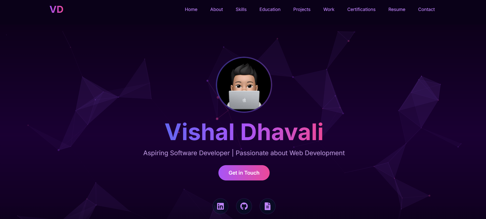

# Vishal Dhavali - Portfolio Website

A modern, interactive portfolio website built with Next.js, featuring particle animations, smooth transitions, and responsive design.

## 🌐 Live Demo

- **Live Preview**: [https://my-portfolio-nu-nine-92.vercel.app/](https://my-portfolio-nu-nine-92.vercel.app/)
- **Status**: [](https://my-portfolio-nu-nine-92.vercel.app/)



## 🌟 Features

- **Interactive Particle Background**: Dynamic particle system with user interaction.
- **Smooth Animations**: Page transitions and scroll animations using Framer Motion.
- **Responsive Design**: Optimized for all device sizes.
- **Dark Theme**: Elegant dark theme with purple and pink accents.
- **Performance Optimized**: Fast loading and smooth performance.
- **Contact Form**: Integrated EmailJS for contact functionality.
- **PDF Resume Viewer**: Interactive resume viewer with zoom capabilities.

## 🛠️ Built With

- [Next.js 14](https://nextjs.org/): React Framework
- [TypeScript](https://www.typescriptlang.org/): Type Safety
- [Tailwind CSS](https://tailwindcss.com/): Styling
- [Framer Motion](https://www.framer.com/motion/): Animations
- [tsParticles](https://particles.js.org/): Particle Effects
- [EmailJS](https://www.emailjs.com/): Contact Form
- [React Icons](https://react-icons.github.io/react-icons/): Icons

## 🚀 Getting Started

### Prerequisites

- Node.js (v18 or higher)
- npm or yarn

### Installation

1. **Clone the repository**:

   ```bash
   git clone https://github.com/vishaldhavali/my_portfolio-website.git
   cd my_portfolio-website
   ```

2. **Install dependencies**:

   ```bash
   npm install
   # or
   yarn install
   ```

3. **Create a **``** file in the root directory** with the following variables:

   ```env
   NEXT_PUBLIC_EMAILJS_SERVICE_ID=your_service_id
   NEXT_PUBLIC_EMAILJS_TEMPLATE_ID=your_template_id
   NEXT_PUBLIC_EMAILJS_PUBLIC_KEY=your_public_key
   ```

4. **Run the development server**:

   ```bash
   npm run dev
   ```

5. **Build for production**:

   ```bash
   npm run build
   npm run start
   ```

## 📁 Project Structure

```bash
my_portfolio-website/
├── app/
│   ├── components/
│   │   ├── backgrounds/
│   │   ├── ui/
│   │   └── ... (component files)
│   ├── hooks/
│   ├── layout.tsx
│   └── page.tsx
├── public/
│   └── assets/
├── styles/
│   └── globals.css
└── ... (config files)
```

## 🎨 Features & Sections

### Home Section

- Interactive particle background
- Animated hero text
- Social media links
- Call-to-action buttons

### About Section

- Professional summary
- Skills overview
- Profile image with hover effects
- Animated skill bars

### Skills Section

- Technical skills display
- Interactive skill cards
- Category-based organization
- Animated icons

### Projects Section

- Project showcases
- Live demos
- GitHub links
- Technology stacks
- Project descriptions

### Experience Section

- Work history timeline
- Company details
- Role descriptions
- Achievement highlights

### Education Section

- Academic background
- Course highlights
- Certifications
- Academic achievements

### Contact Section

- Contact form with validation
- Email integration
- Social media links
- Location information

### Resume Section

- PDF resume viewer
- Download option
- Zoom controls
- Full-screen mode

## 🔧 Configuration

### Particle Effects

Customize particle animations in `ParticleBackground.tsx`:

```typescript
const particleOptions = {
  particles: {
    number: {
      value: 80,
      density: {
        enable: true,
        area: 800,
      },
    },
    // ... more options
  },
};
```

### Environment Variables

Ensure the following environment variables are set:

```env
NEXT_PUBLIC_EMAILJS_SERVICE_ID=your_service_id
NEXT_PUBLIC_EMAILJS_TEMPLATE_ID=your_template_id
NEXT_PUBLIC_EMAILJS_PUBLIC_KEY=your_public_key
```

## 📱 Responsive Design

- **Mobile**: `< 768px`
- **Tablet**: `768px - 1024px`
- **Desktop**: `> 1024px`

## 🚀 Deployment

### Vercel Deployment

1. Push to GitHub
2. Connect to Vercel
3. Configure environment variables
4. Deploy

## 🎯 Performance Optimization

- Image optimization with `next/image`
- Lazy loading components
- Route prefetching
- Code splitting
- Performance monitoring

## 🔒 Security

- Form validation
- Environmental variable protection
- Secure external links
- XSS protection

## 📄 License

This project is licensed under the MIT License - see the LICENSE file for details.

## 📞 Contact

- **Email**: [vishaldhavali2209@gmail.com](mailto:vishaldhavali2209@gmail.com)
- **LinkedIn**: Vishal Dhavali
- **GitHub**: [@vishaldhavali](https://github.com/vishaldhavali)

## 🙏 Acknowledgments

- Next.js Documentation
- Tailwind CSS
- Framer Motion
- tsParticles

Made with ❤️ by Vishal Dhavali
